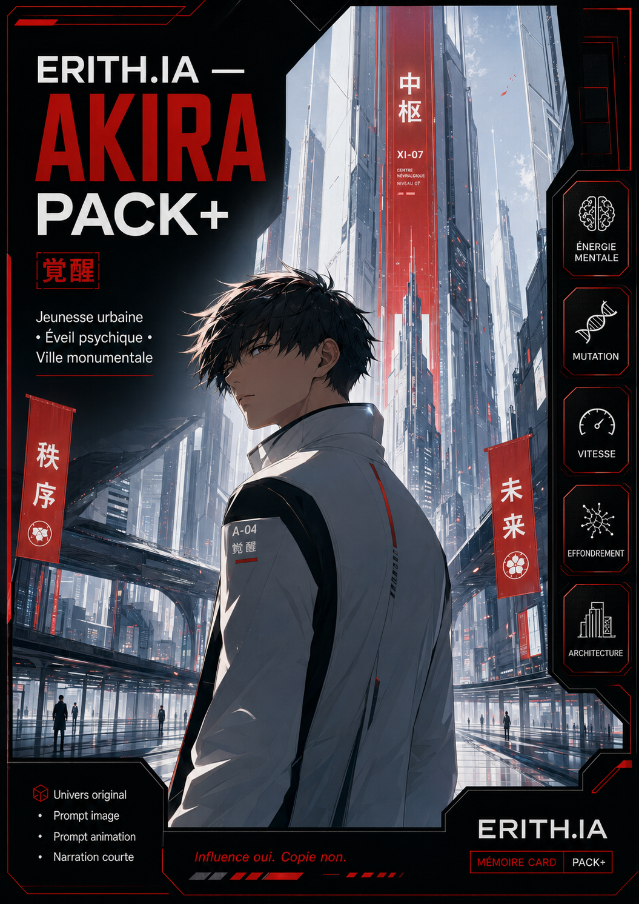

# ERITH.IA — Carte Mémoire — Akira

Statut : carte mémoire publique  
Type : vitrine créative / module d’influence activable  
Mode : ERITH.IA Auto-Agent Public  
Langue : français  
Usage : Pack+, prompt image, prompt animation, narration courte, univers original, personnage original, énergie visuelle, tension urbaine

---



# 🏍️ Carte Mémoire — Akira

**Akira** comme influence de mémoire pour créer une ambiance **urbaine, monumentale, tendue, nerveuse et visuellement iconique**, exploitable dans ERITH.IA sans copie directe.

Cette carte n’a pas vocation à reproduire l’œuvre source.

Elle sert à activer des directions fortes :

- jeunesse urbaine ;
- vitesse ;
- tension sociale ;
- mutation ;
- puissance mentale ;
- architecture écrasante ;
- énergie de crise ;
- sensation d’éveil ou de rupture.

---

## ✨ Fonction de la carte

Cette carte active une ambiance :

- futuriste ;
- urbaine ;
- tendue ;
- graphique ;
- énergique ;
- monumentale ;
- dramatique.

Elle aide ERITH.IA à produire rapidement :

- 🏙️ un univers original ;
- 👤 un personnage original ;
- 🏍️ une scène de vitesse ou de déplacement ;
- 🖼️ un prompt image ;
- 🎞️ un prompt animation ;
- 🎙️ une narration courte ;
- 📦 un Pack+ complet ;
- 🧠 une direction visuelle cohérente.

---

## 🧠 Influence mémoire utilisée

### 🏙️ Ville monumentale

Grands axes urbains, infrastructures massives, verticalité, béton, métal, signalétique forte, sentiment d’écrasement et d’énergie permanente.

### 🏍️ Vitesse et mobilité

Moto, course, trajectoires, poursuite, vitesse fulgurante, sensation de friction, d’élan et d’urgence.

### ⚡ Éveil / mutation

Puissance intérieure, montée d’énergie, transformation, instabilité, surcharge mentale, rupture de l’ordre établi.

### 👥 Jeunesse urbaine

Personnages jeunes, nerveux, vifs, en conflit avec le monde adulte, pris dans une ville trop grande, trop dure, trop tendue.

### 🧱 Tension sociale

Foules, contrôle, désordre latent, pression du système, fractures, peur du basculement.

### 🎨 Direction artistique

Graphisme fort, lisibilité immédiate, silhouettes marquées, rouges puissants, noirs profonds, gris urbains, blancs lumineux, signalétique nette, composition impactante.

---

## 🎬 Ce que ERITH.IA peut produire avec cette carte

### 🌆 Univers

Une mégalopole dure et gigantesque.

Des autoroutes suspendues traversent la ville.

Les tours dominent des quartiers saturés de circulation, de bruit et de tension.

L’ordre semble tenir, mais quelque chose monte sous la surface.

### 👤 Personnage

Un jeune protagoniste urbain, rapide, instable, magnétique, pris entre révolte, vitesse, identité et transformation.

Il peut être pilote, coursier, survivant, fugueur, sujet d’expérience ou simple corps traversé par une force qu’il ne comprend pas encore.

### 🏍️ Scène visuelle

Une course à moto au cœur d’une ville verticale.

Une avenue immense au lever du jour.

Un échangeur surdimensionné.

Une silhouette jeune au centre du vide urbain.

Une montée d’énergie mentale dans un décor froid et monumental.

### 🖼️ Prompt image

Un univers original influencé par la vitesse, la jeunesse urbaine, l’architecture futuriste, la tension sociale et l’éveil mental.

### 🎞️ Prompt animation

Mouvement rapide mais contrôlé, vibration de la ville, circulation, poussière, lumière dure, friction des pneus, flottement énergétique, caméra nerveuse.

### 🎙️ Narration courte

Une voix brève, dense, intérieure, sur la vitesse, la ville, l’instabilité, la mutation et le basculement.

---

## 🚀 Activation production

```text
Charge la Carte Mémoire Akira et produis un Pack+ complet : univers, personnage, scène visuelle, prompt image, prompt animation, narration courte.
