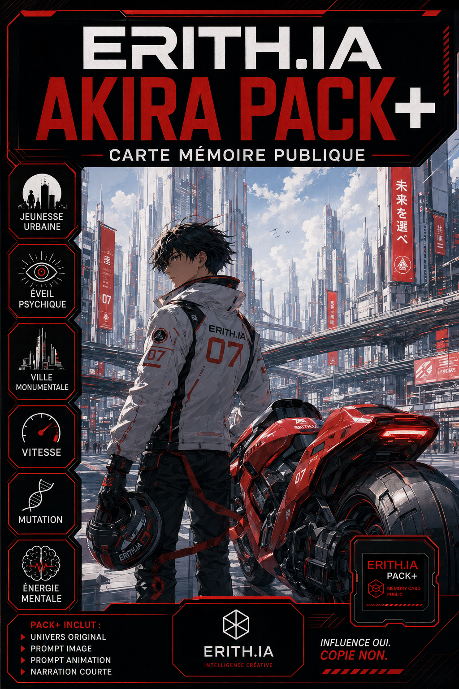
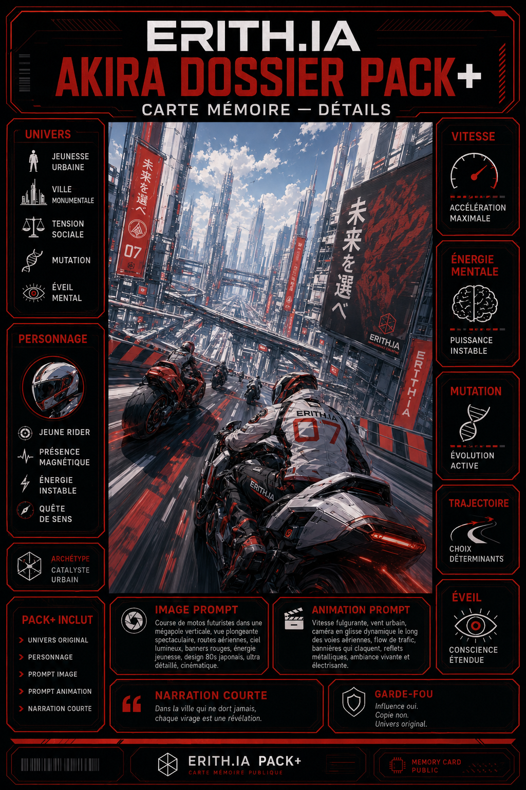

# ERITH.IA — Carte Mémoire — Akira

Statut : carte mémoire publique  
Type : vitrine créative / module d’influence activable  
Mode : ERITH.IA Auto-Agent Public  
Langue : français  
Usage : Pack+, prompt image, prompt animation, narration courte, univers original, personnage original, énergie visuelle, tension urbaine

---


# 🏍️ Carte Mémoire — Akira

**Akira** comme influence de mémoire pour créer une ambiance **urbaine, monumentale, tendue, nerveuse et visuellement iconique**, exploitable dans ERITH.IA sans copie directe.

Cette carte n’a pas vocation à reproduire l’œuvre source.

Elle sert à activer des directions fortes :

- jeunesse urbaine ;
- vitesse ;
- tension sociale ;
- mutation ;
- puissance mentale ;
- architecture écrasante ;
- énergie de crise ;
- sensation d’éveil ou de rupture.

---

## ✨ Fonction de la carte

Cette carte active une ambiance :

- futuriste ;
- urbaine ;
- tendue ;
- graphique ;
- énergique ;
- monumentale ;
- dramatique.

Elle aide ERITH.IA à produire rapidement :

- 🏙️ un univers original ;
- 👤 un personnage original ;
- 🏍️ une scène de vitesse ou de déplacement ;
- 🖼️ un prompt image ;
- 🎞️ un prompt animation ;
- 🎙️ une narration courte ;
- 📦 un Pack+ complet ;
- 🧠 une direction visuelle cohérente.

---

## 🧠 Influence mémoire utilisée

### 🏙️ Ville monumentale

Grands axes urbains, infrastructures massives, verticalité, béton, métal, signalétique forte, sentiment d’écrasement et d’énergie permanente.

### 🏍️ Vitesse et mobilité

Moto, course, trajectoires, poursuite, vitesse fulgurante, sensation de friction, d’élan et d’urgence.

### ⚡ Éveil / mutation

Puissance intérieure, montée d’énergie, transformation, instabilité, surcharge mentale, rupture de l’ordre établi.

### 👥 Jeunesse urbaine

Personnages jeunes, nerveux, vifs, en conflit avec le monde adulte, pris dans une ville trop grande, trop dure, trop tendue.

### 🧱 Tension sociale

Foules, contrôle, désordre latent, pression du système, fractures, peur du basculement.

### 🎨 Direction artistique

Graphisme fort, lisibilité immédiate, silhouettes marquées, rouges puissants, noirs profonds, gris urbains, blancs lumineux, signalétique nette, composition impactante.

---

## 🎬 Ce que ERITH.IA peut produire avec cette carte

### 🌆 Univers

Une mégalopole dure et gigantesque.

Des autoroutes suspendues traversent la ville.

Les tours dominent des quartiers saturés de circulation, de bruit et de tension.

L’ordre semble tenir, mais quelque chose monte sous la surface.

### 👤 Personnage

Un jeune protagoniste urbain, rapide, instable, magnétique, pris entre révolte, vitesse, identité et transformation.

Il peut être pilote, coursier, survivant, fugueur, sujet d’expérience ou simple corps traversé par une force qu’il ne comprend pas encore.

### 🏍️ Scène visuelle

Une course à moto au cœur d’une ville verticale.

Une avenue immense au lever du jour.

Un échangeur surdimensionné.

Une silhouette jeune au centre du vide urbain.

Une montée d’énergie mentale dans un décor froid et monumental.

### 🖼️ Prompt image

Un univers original influencé par la vitesse, la jeunesse urbaine, l’architecture futuriste, la tension sociale et l’éveil mental.

### 🎞️ Prompt animation

Mouvement rapide mais contrôlé, vibration de la ville, circulation, poussière, lumière dure, friction des pneus, flottement énergétique, caméra nerveuse.

### 🎙️ Narration courte

Une voix brève, dense, intérieure, sur la vitesse, la ville, l’instabilité, la mutation et le basculement.

---

## 🚀 Activation production

```text
Charge la Carte Mémoire Akira et produis un Pack+ complet : univers, personnage, scène visuelle, prompt image, prompt animation, narration courte.
```

---

# 📦 Pack+ public — Akira

Ce Pack+ public montre comment ERITH.IA transforme la Carte Mémoire Akira en sortie de production exploitable.

Il sert à générer :

- un univers original ;
- un personnage original ;
- une scène de vitesse ;
- un prompt image ;
- un prompt animation ;
- une narration courte ;
- une variante ;
- un garde-fou créatif.

---

## 📌 Nom du Pack+

**Akira — Vitesse, Éveil & Ville monumentale**

---

## 🖼️ Cover Pack+ associée



Visuel principal du Pack+ Akira :

- personnage original ;
- moto ;
- vitesse ;
- ville monumentale ;
- énergie de crise ;
- esprit d’éveil.

---

## 🗂️ Dossier Pack+ associé



Visuel complémentaire de type dossier / fiche créative pour approfondir :

- l’univers ;
- le personnage ;
- les thèmes ;
- les textures visuelles ;
- l’ambiance sonore ;
- les intentions de production.

---

## 🌆 Concept d’univers

Dans une immense ville futuriste, la vitesse est devenue une langue.

Les avenues suspendues, les tours froides et les couloirs d’acier dessinent un monde où la jeunesse survit entre déplacement, colère, instinct et soif de puissance.

Sous la surface rationnelle de la ville, des phénomènes émergent :

- réveils psychiques ;
- dérèglements énergétiques ;
- mutations incontrôlées ;
- tensions sociales prêtes à rompre.

Le monde semble encore fonctionner.

Mais il est déjà entré dans sa phase de tremblement.

Question centrale :

**Que devient un être humain quand sa force intérieure grandit plus vite que le monde capable de la contenir ?**

---

## 👤 Personnage exemple

Nom de travail :

**Kaïren**

Rôle :

**Rider urbain / vecteur d’éveil**

Kaïren traverse la ville à haute vitesse sur une moto de course allégée.

Il connaît les boulevards suspendus, les zones d’ombre et les passages oubliés sous les grandes structures.

Depuis quelque temps, il ressent une pression nouvelle :

- accélération des perceptions ;
- rêves saturés de lumière ;
- tension mentale croissante ;
- perte de repères dans le réel.

Il ne sait pas encore si cette force va le révéler ou le détruire.

Tension intérieure :

**Kaïren cherche la liberté dans la vitesse, mais quelque chose en lui commence à aller plus vite encore que sa propre volonté.**

---

## 🏍️ Scène exemple

En plein jour, une course traverse les hauteurs de la ville.

Les voies rapides serpentent entre des tours blanches et grises, barrées de signalétiques rouges.

Les motos filent à grande vitesse sur des rubans d’asphalte suspendus.

En tête, Kaïren incline sa machine dans une courbe monumentale.

La ville entière semble l’observer.

Autour de lui :

- drones de surveillance ;
- reflets métalliques ;
- poussière chaude ;
- vent sec ;
- architecture écrasante.

Un bref trouble traverse l’air autour de lui.

Comme si sa vitesse réveillait autre chose que le simple mouvement.

---

## 🖼️ Prompt image — scène principale

```text
Original futuristic urban scene inspired by monumental city architecture, youth energy, speed, psychic tension and dramatic visual design. Broad daylight. A giant vertical city with elevated highways, sleek towers, strong red accents, white and gray architecture, deep shadows and clean graphic forms.

A young original rider stands with or beside a futuristic motorcycle after or during a high-speed run. Dynamic hair, sharp silhouette, intense calm expression, stylish jacket, athletic posture. The city feels immense around the character.

Mood: tension, awakening, velocity, youth, transformation, unstable energy. Themes: speed, urban identity, mental power, mutation, pressure, monumental city.

Strong art direction, anime-inspired original visual language, clean shapes, dramatic composition, elegant graphic design, no copyrighted characters, no franchise logos, no exact replication of any known design.
```

---

## 🎞️ Prompt animation — Wan / I2V

```text
Subtle but powerful motion. The futuristic city breathes with scale and tension. Heat shimmer and light wind move through the scene. The rider’s jacket and hair react slightly. The motorcycle emits a controlled vibration. Distant traffic flows across elevated roads. Light particles and fine debris pass through the frame. A faint energetic distortion appears briefly around the rider, suggesting inner awakening. Camera mostly stable with a slow cinematic drift. Preserve character design, motorcycle silhouette, composition and monumental daytime city atmosphere.
```

---

## 🎙️ Narration courte

La ville a été construite pour contenir le mouvement.

Mais certaines vitesses ne se mesurent pas en kilomètres.

Elles naissent dans le corps, traversent l’esprit, et finissent par fissurer le monde lui-même.

---

## 🌙 Variante B — Éveil mental

Dans cette variante, la vitesse devient secondaire.

Le centre de la scène n’est plus la moto.

C’est la pression intérieure.

Le personnage se trouve seul dans une architecture vide, traversé par une montée d’énergie mentale difficile à contenir.

Le monde visuel devient plus silencieux, plus tendu, plus blanc, plus rouge, plus abstrait.

La ville ne fait plus seulement décor.

Elle devient caisse de résonance.

---

## 🛡️ Garde-fou créatif

Cette carte ne sert pas à copier l’œuvre source.

Elle sert à activer des directions :

- ville monumentale ;
- jeunesse urbaine ;
- vitesse ;
- tension ;
- mutation ;
- éveil ;
- architecture forte.

Interdit :

- 🚫 reprendre des personnages existants ;
- 🚫 reprendre des noms propres de l’œuvre source ;
- 🚫 reprendre une intrigue reconnaissable ;
- 🚫 reprendre un design exact ;
- 🚫 reprendre une scène iconique à l’identique ;
- 🚫 produire un pastiche trop proche.

Autorisé :

- ✅ créer une ville originale ;
- ✅ créer un rider original ;
- ✅ créer une scène de course originale ;
- ✅ explorer l’éveil ou la mutation sous forme inédite ;
- ✅ utiliser une direction graphique forte ;
- ✅ produire un Pack+ exploitable en production.

---

## ⚡ Commande complète à donner à ERITH.IA

```text
Charge la Carte Mémoire Akira.

Utilise cette influence comme base créative sans jamais copier l’œuvre source.

Active les axes suivants :
- ville monumentale ;
- jeunesse urbaine ;
- vitesse ;
- moto ;
- tension sociale ;
- mutation ;
- énergie mentale ;
- direction artistique forte.

Crée un Pack+ complet avec :
1. concept d’univers ;
2. personnage original ;
3. scène visuelle ;
4. prompt image ;
5. prompt animation ;
6. narration courte ;
7. variante B ;
8. garde-fou créatif.

Règles :
Univers original obligatoire.
Aucun personnage existant.
Aucun nom propre repris.
Aucune intrigue copiée.
Aucun design exact.
Influence oui. Copie non.
```

---

## 🧠 Résumé LLM intégré

Cette Carte Mémoire Akira active une influence de science-fiction urbaine monumentale, centrée sur la jeunesse, la vitesse, l’éveil, la mutation, la ville massive et la puissance incontrôlable.

Elle doit produire des univers originaux.

Elle peut utiliser :

- mégalopole futuriste ;
- architecture massive ;
- béton ;
- routes suspendues ;
- moto ou véhicule urbain original ;
- énergie psychique ;
- mutation organique ;
- laboratoire ;
- État opaque ;
- jeunesse en rupture ;
- tension sociale ;
- catastrophe imminente ;
- rouge signal ;
- noir profond ;
- blanc clinique ;
- gris béton ;
- animation japonaise cinématique ;
- composition graphique forte.

Elle ne doit jamais copier :

- personnages ;
- noms propres ;
- scènes cultes ;
- véhicules iconiques ;
- costumes exacts ;
- intrigue originale ;
- design reconnaissable.

Règle finale :

**Akira inspire l’intensité. ERITH.IA crée un monde original.**

---

## 🧩 Formule courte

**Ville + Vitesse + Éveil**

**Jeunesse + Mutation + Architecture**

**Énergie + Tension + Futur**

Influence oui.

Copie non.

Création toujours.

---

## 🔗 Ressources publiques

### 🖼️ Image cover principale

https://github.com/BlueAzur-Hub/erith-ia-memory/blob/main/assets/images/erith_ia_memory_card_akira_public_pack_plus_cover_premium_v1.png

### 🏍️ Image cover Pack+ rider / bike

https://github.com/BlueAzur-Hub/erith-ia-memory/blob/main/assets/images/erith_ia_memory_card_akira_rider_bike_pack_plus_cover_premium_v2.png

### 🗂️ Image dossier Pack+ rider / bike

https://github.com/BlueAzur-Hub/erith-ia-memory/blob/main/assets/images/erith_ia_memory_card_akira_rider_bike_pack_plus_dossier_premium_v1.png

---

## 🧾 Note publique

Cette carte fait partie de la vitrine publique ERITH.IA.

Elle expose une influence créative activable sans publier les sources profondes, la mémoire privée ou l’atelier complet du projet.

Elle est conçue pour montrer comment ERITH.IA peut transformer une influence culturelle forte en outil de production original, cohérent et exploitable.
