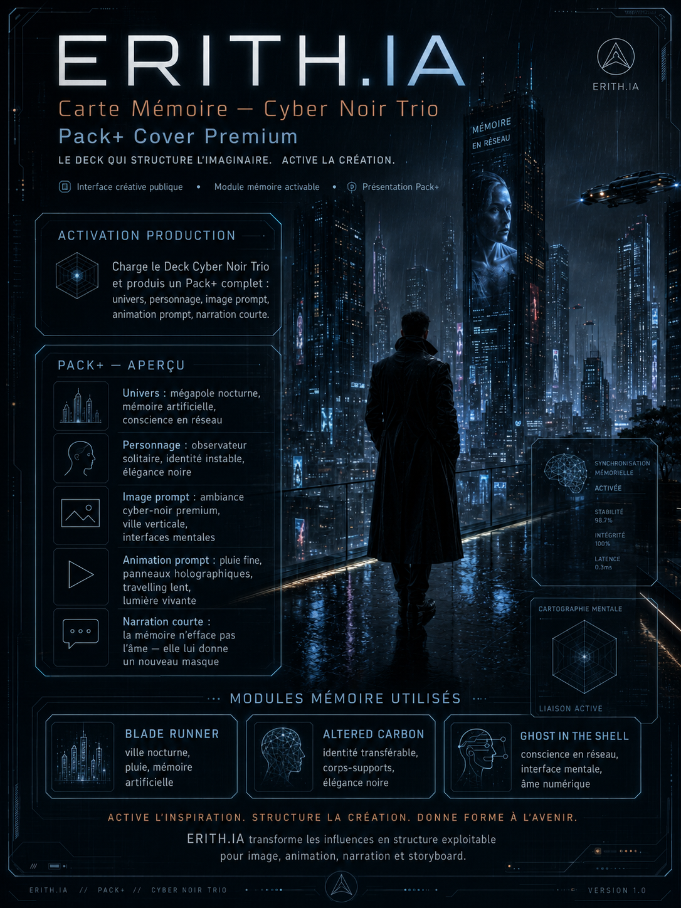
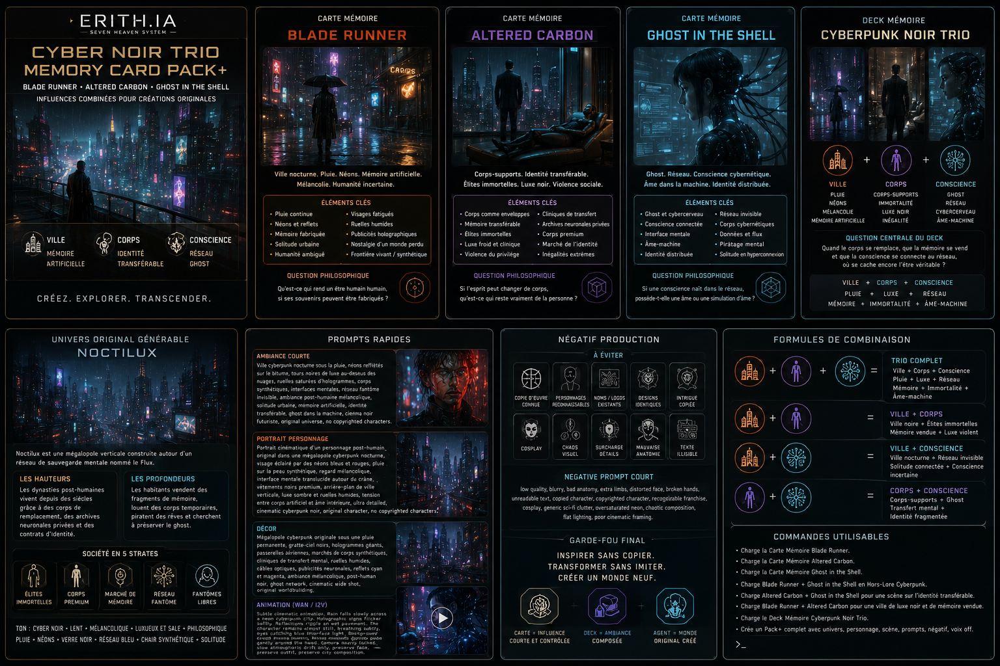

# ERITH.IA — Carte Mémoire — Cyber Noir Trio

Statut : carte mémoire publique  
Type : vitrine créative / module d’influence activable  
Mode : ERITH.IA Auto-Agent Public  
Langue : français  
Usage : Pack+, prompt image, prompt animation, narration courte, worldbuilding, personnage original

---



---

# 🌃 Carte Mémoire — Cyber Noir Trio

**Blade Runner × Altered Carbon × Ghost in the Shell**

Influences de mémoire pour créer un **Cyber Noir original**, autonome, élégant et exploitable en production.

Cette carte ne copie aucune œuvre source.

Elle utilise uniquement des directions esthétiques, philosophiques et narratives générales pour aider ERITH.IA à générer un univers original.

---

## ✨ Fonction de la carte

Cette carte active une ambiance **urbaine, nocturne, post-humaine et philosophique**.

Elle sert à produire rapidement :

🧬 un univers cyber noir original

👤 un personnage post-humain

🌧️ une scène nocturne sous la pluie

🖼️ un prompt image

🎞️ un prompt animation

🎙️ une narration courte

📦 un Pack+ complet

---

## 🧠 Influences mémoire utilisées

### 🌧️ Blade Runner

Ville nocturne, pluie, néons, mémoire artificielle, solitude, reflets, enquête intérieure et mélancolie cyberpunk.

### 🧬 Altered Carbon

Identité transférable, corps-supports, élites immortelles, luxe noir, fracture sociale, mémoire comme propriété et violence du privilège.

### 👻 Ghost in the Shell

Ghost, conscience en réseau, interface mentale, âme numérique, frontière humain-machine et identité distribuée.

---

## 🎬 Ce que ERITH.IA peut produire avec cette carte

### 🌆 Univers

Une mégalopole verticale, humide, saturée de néons, de réseaux invisibles et de souvenirs artificiels.

Les hauteurs appartiennent aux élites post-humaines.

Les profondeurs appartiennent aux corps loués, aux mémoires vendues et aux consciences perdues dans le réseau.

### 🧍 Personnage

Un être post-humain dont le corps, la mémoire et l’identité ne coïncident plus tout à fait.

Il peut avoir changé de corps.

Il peut porter des souvenirs qui ne sont pas les siens.

Il peut chercher à savoir si son âme est encore réelle ou seulement archivée.

### 🖼️ Image prompt

Portrait ou décor cyber noir :

pluie, reflets, hologrammes, corps synthétiques, interfaces mentales, ville verticale, luxe sombre, solitude, mémoire artificielle.

### 🎞️ Animation prompt

Pluie lente.

Néons qui vibrent.

Interfaces qui pulsent.

Personnage presque immobile.

Caméra subtile.

Ambiance contemplative, urbaine et mélancolique.

### 🎙️ Narration courte

Une voix intérieure sur la mémoire, le corps, l’âme et la trace de l’humain dans la machine.

---

## 🚀 Activation production

```text
Charge le Deck Cyberpunk Noir Trio et produis un Pack+ complet : univers, personnage, image prompt, animation prompt, narration courte.

---

# 🎛️ Pack+ complet — Cyber Noir Trio

Ce Pack+ public montre comment ERITH.IA transforme la Carte Mémoire Cyber Noir Trio en sortie de production complète.

Il sert à générer :

- un univers original ;
- un personnage ;
- une scène ;
- un prompt image ;
- un prompt animation ;
- une narration courte ;
- une variante ;
- un garde-fou créatif.

---

## 📌 Nom du Pack+

Cyber Noir Trio — Mémoire, Corps & Ghost

---

## 🖼️ Image de couverture associée



Fichier image recommandé :

cyberpunk_noir_trio_memory_card_pack_cover_v1.png

---

## 🌆 Concept d’univers

Dans une mégalopole verticale noyée sous la pluie, les souvenirs sont devenus une matière première.

Les corps peuvent être remplacés, loués ou restaurés.

Les consciences circulent dans des réseaux privés, des coffres neuronaux et des architectures mentales invisibles.

Les élites vivent au-dessus des nuages dans des tours de verre noir.

Les rues basses survivent sous les néons, les dettes corporelles, les marchés de mémoire et les fantômes numériques.

Question centrale :

Si le corps change, si la mémoire se copie, si la conscience traverse le réseau, où se cache encore l’être véritable ?

---

## 👤 Personnage original

Nom de travail :

Nara Vey

Rôle :

Archiviste de mémoire illégale.

Description :

Nara restaure des fragments de souvenirs effacés pour des clients qui ne savent plus s’ils veulent retrouver la vérité ou seulement une version supportable d’eux-mêmes.

Son corps actuel n’est pas son premier.

Sa mémoire contient plusieurs zones blanches.

Elle entend parfois une voix dans le réseau, une présence inconnue qui semble connaître des souvenirs qu’elle n’a jamais vécus.

Tension intérieure :

Nara vend la mémoire des autres, mais ne possède plus totalement la sienne.

---

## 🎬 Scène visuelle

Une rue cyber noir sous une pluie lente.

Les néons se reflètent sur le sol comme des cicatrices liquides.

Au fond, des tours noires disparaissent dans les nuages.

Nara Vey se tient sous un abri holographique défectueux, un fragment de mémoire flottant entre ses mains.

Autour d’elle, les passants ne regardent plus avec leurs yeux : leurs interfaces mentales filtrent la réalité.

Un visage apparaît brièvement dans la pluie numérique.

Il semble la reconnaître.

Elle ne l’a jamais vu.

---

## 🖼️ Prompt image — scène principale

Original cyber noir cinematic scene in a vertical rainy megacity at night, wet reflective streets, deep blue and amber neon lights, black glass towers disappearing into clouds, holographic signs, memory archive interfaces, post-human atmosphere.

A solitary original female memory archivist stands under a broken holographic shelter, holding a floating translucent memory fragment between her hands. Her expression is calm but haunted. Subtle neural interface lights around her temples. Elegant dark coat, refined post-human design, no recognizable franchise elements.

Around her, blurred silhouettes walk through rain, their faces partially hidden by faint augmented reality overlays. In the background, luxury towers rise above the lower city, suggesting immortal elites and social fracture.

Mood: melancholic, philosophical, elegant, cinematic cyber noir. Themes: artificial memory, transferable identity, body as vessel, ghost in the network, soul inside the machine.

Ultra detailed, cinematic lighting, atmospheric rain, shallow depth of field, beautiful composition, original universe, no copyrighted characters, no logos, no existing franchise design.

---

## 🧍 Prompt image — portrait personnage

Cinematic portrait of an original post-human memory archivist in a cyber noir universe, rain on synthetic skin, dark elegant coat, subtle neural interface near the temples, reflective eyes illuminated by blue and amber holograms.

The character holds a small floating memory shard made of light and glass. Behind her, a blurred vertical megacity glows through rain and mist.

Mood of melancholy, identity crisis, artificial memory, ghost in the network, human soul questioned by machine systems.

Refined cyber noir style, elegant composition, emotional face, atmospheric lighting, original character, no copyrighted characters, no logos, no franchise elements.

---

## 🌃 Prompt image — décor

Wide cinematic shot of an original cyber noir megacity under permanent rain, vertical black glass towers, dense neon streets, reflective pavement, floating advertisements, memory clinics, body-transfer salons, neural network temples, luxury districts above the clouds and crowded lower levels below.

The city feels alive, lonely and post-human.

Blue, cyan, amber and red neon reflections.

Holographic memory streams move through the air like ghostly rivers.

Dark elegant atmosphere, philosophical science fiction, original worldbuilding, no copyrighted characters, no recognizable franchise design.

---

## 🎞️ Prompt animation — Wan / I2V

Subtle cinematic animation.

Rain falls slowly through a cyber noir night city.

Neon reflections ripple on the wet pavement.

Holographic signs flicker gently.

The memory fragment in the character’s hands pulses with soft blue light.

Her coat moves slightly in the rain.

Background silhouettes pass slowly, blurred and quiet.

Faint neural interface glyphs appear and disappear around her head.

Camera nearly locked, very slow atmospheric drift only.

Preserve face, preserve outfit, preserve composition, preserve cyber noir mood.

---

## 🎙️ Narration courte

Dans cette ville, les corps se remplacent plus vite que les vérités.

Les riches achètent des vies entières.

Les pauvres vendent des souvenirs pour survivre.

Et quelque part dans le réseau, une conscience sans corps continue d’appeler par un nom que personne ne devrait connaître.

---

## 🌙 Variante B — Ghost Network

Dans cette variante, l’univers devient plus intérieur, plus silencieux, plus mental.

La pluie reste présente, mais le centre de la scène n’est plus la ville : c’est le réseau.

Les consciences apparaissent comme des silhouettes lumineuses dans une architecture mentale noire et bleue.

Le personnage n’enquête plus seulement sur une mémoire volée.

Il cherche à savoir si une conscience née dans le réseau peut devenir une personne.

Prompt court :

Original ghost network cyber noir scene, dark mental cyberspace, floating human silhouettes made of blue light, memory fragments drifting like glass petals, central post-human character connected to invisible neural architecture, calm philosophical mood, identity and soul inside the machine, elegant cinematic composition, no copyrighted characters.

---

## 🛡️ Garde-fou production

Cette carte ne sert pas à copier les œuvres sources.

Elle sert à créer un monde original à partir de trois axes :

- ville nocturne et mémoire artificielle ;
- corps-supports et identité transférable ;
- conscience en réseau et âme numérique.

Interdit :

- reprendre un personnage existant ;
- reprendre un nom propre d’œuvre source ;
- reprendre une organisation connue ;
- reprendre une intrigue reconnaissable ;
- reproduire un design exact ;
- produire un pastiche trop identifiable.

Autorisé :

- créer une ambiance cyber noir ;
- explorer la mémoire artificielle ;
- explorer le corps comme support ;
- explorer la conscience connectée ;
- créer des personnages originaux ;
- produire un Pack+ exploitable.

---

## ⚡ Commande complète à donner à ERITH.IA

Charge la Carte Mémoire Cyber Noir Trio.

Utilise les influences suivantes sans jamais les copier :

Blade Runner pour la ville nocturne, la pluie, les néons, la mémoire artificielle et la mélancolie cyberpunk.

Altered Carbon pour les corps-supports, l’identité transférable, les élites immortelles, le luxe noir et la fracture sociale.

Ghost in the Shell pour le ghost, la conscience en réseau, les interfaces mentales et la question de l’âme dans la machine.

Crée un Pack+ complet avec :

1. concept d’univers ;
2. personnage original ;
3. scène visuelle ;
4. prompt image ;
5. prompt animation ;
6. narration courte ;
7. variante B ;
8. garde-fou créatif.

Règles :

Univers original obligatoire.

Aucun personnage existant.

Aucun nom propre repris.

Aucune intrigue copiée.

Aucun design exact.

Influence oui. Copie non.
